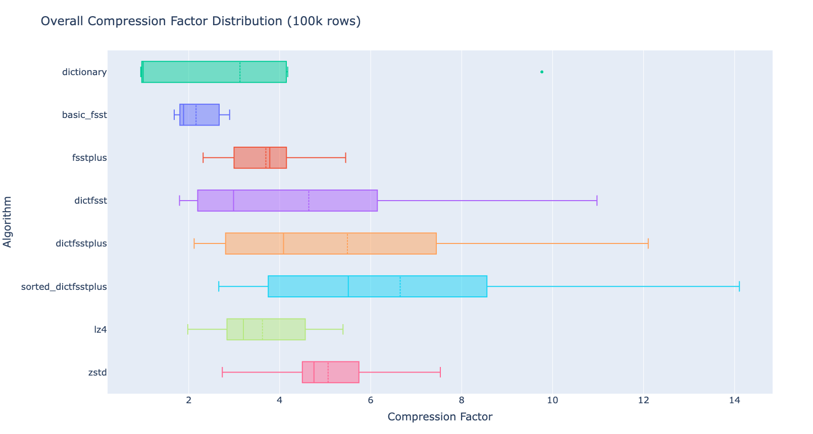

# 

[](https://opensource.org/licenses/MIT)

[**FSST+**](https://homepages.cwi.nl/~boncz/msc/2025-YanLannaAlexandre.pdf) is an enhanced string compression system that extends the [Fast Static Symbol Table (FSST)](https://github.com/cwida/fsst) algorithm to effectively compress prefix-heavy datasets while preserving its critical fast random-access capabilities.

Modern analytical databases process vast amounts of string data. General-purpose compressors like **Zstandard** offer high ratios but lack fast random access, while lightweight schemes like **FSST** offer speed but fail to exploit longer-range redundancies, such as shared prefixes in URLs, file paths, or identifiers. FSST+ bridges this gap, providing high compression density and fast individual string decompression.

## The Problem

Textual data in analytical workloads is often repetitive in specific ways. Consider a column of URLs:

```
https://www.reddit.com/r/technology
https://www.reddit.com/r/dataengineering
https://www.reddit.com/r/pics
```

- A block compressor like **Zstandard** would efficiently compress the shared `https://www.reddit.com/r/` prefix, but you would need to decompress the entire block to access a single URL.
- A random-access compressor like **FSST** decompresses individual strings instantly, but does not inherently exploit prefix redundancies that span across multiple strings.

This leaves a clear opportunity for a compressor that can do both: exploit long-range prefix redundancy **and** decompress any individual string instantly.

## The Solution: FSST+

FSST+ introduces a novel compression layout that eliminates prefix redundancy. Common prefixes are stored only once per data block. Unique suffixes then reference these shared prefixes using lightweight, direct-addressable offsets.

This design enables the efficient decompression of any individual string without scanning neighboring data, combining the best of both worlds.


## Key Features

- **High Compression on Prefix-Heavy Data:** Outperforms standard FSST by an average of 70% on prefix-rich columns.
- **Fast Random Access:** Preserves the core benefit of FSST, allowing any string to be decompressed individually without scanning its neighbors.
- **State-of-the-Art Dictionary Compression:** When used to compress a dictionary (`DICT FSST+`), it can achieve higher compression ratios than Zstandard on prefix-rich data.
- **Efficient Algorithm:** Employs a linear-time dynamic programming solution (through batching) to find optimal prefixes.
- **Database-Friendly:** Designed for the specific needs of modern analytical database systems and columnar storage.

## Performance Highlights

Our comprehensive evaluation on real-world analytical benchmarks demonstrates the efficacy of FSST+.

On prefix-rich columns, **FSST+** consistently delivers superior compression ratios compared to FSST and LZ4, while **DICT FSST+** (especially with a sorted dictionary) outperforms Zstandard.


*(Box plot showing the mean compression factor of different algorithms across several prefix-heavy benchmark columns. Higher is better.)*

| Algorithm               | Mean Compression Factor | Key Advantage                                   |
|-------------------------|-------------------------|-------------------------------------------------|
| basic_fsst              | 2.16                    | Fast random access, low compression             |
| **fsst_plus**           | **3.70 (+70%)**         | **Fast random access, good compression**        |
| lz4                     | 3.62                    | Fast block compression, no random access        |
| dictfsst                | 4.64                    | Good for duplicates                             |
| zstd                    | 5.07                    | High block compression factor, no random access |
| **dictfsstplus**        | **5.49 (+115%)**        | **Excellent for duplicates + prefixes**         |
| **sorted_dictfsstplus** | **6.65 (+208%)**        | **Beats Zstd while retaining random access**    |

## DICT FSST+: The Best Results

The most powerful application of FSST+ is compressing a pre-existing dictionary from a dictionary-encoded column.

Since the physical storage order of dictionary entries is arbitrary, we can **lexicographically sort them** before compression. This groups strings with shared prefixes together, creating the ideal input for FSST+.

This `Sorted DICT FSST+` approach establishes a practical upper bound on prefix-sharing potential and represents a powerful strategy for optimizing storage in analytical systems.

## Installation

This project uses CMake for building.

First run the commands

```git clone --recurse-submodules```

then

```cd third_party/duckdb && GEN=ninja make```

and

``
cd third_party/fsst && cmake -S . -B build
``

You should now be able to run it normally using CMake.

Make sure to add the .parquet datasets you would like to run on to `benchmarking/data/raw`, and run the `benchmarking/etl/transform&load/refine_datasets.py` python script. 

Also, set the correct path to your project directory in `src/env.h`.

## License

This project is licensed under the MIT License. See the [LICENSE](LICENSE) file for details.